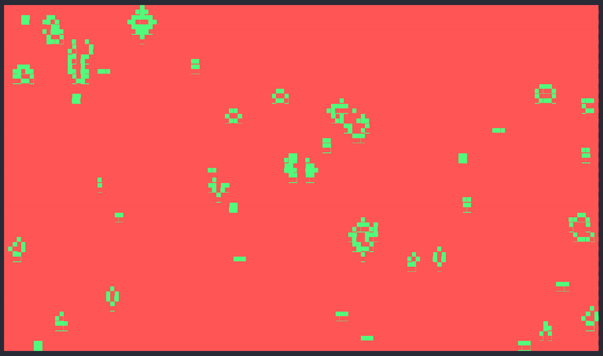

Simulate cellular automaton directly to the terminal

## Usage

usage: `tca [-h] [-r REFRESH_RATE] [-g GENERATIONS] [-x] [-n] target`

A cellular automaton simulator with support for terminal rendering

positional arguments:
  `target (SCENARIO NAME; FILE NAME; RLE AT REMOTE URL)`

options:

  `-h`, `--help`            show this help message and exit

  `-r REFRESH_RATE`, `--refresh-rate REFRESH_RATE`
                            The refresh rate of the simulation (default: 30)

  `-g GENERATIONS`, --generations GENERATIONS
                            The number of generations the simulation should run for (default: `0` (infinity))

  `-x`, `--debug`           Flag to make the simluation run in debug mode (default: `False`)

  `-n`, `--no-render`       Disables simulation rendering to the terminal (default: `False`)

## Built in scenarios
While `tca` can read most `rle` (URL or local path) and `life` (local path) compliant inputs, there are a few prebuilt scenarios available that can be observed by running `tca <SCENARIO>`

- `conway_1`: A simple game of life automaton where each cell has an equal chance to 'spawn' as 'alive' 'dead'
- `conway_2`: Each cell has a 10% chance of spawning as alive
- `pulsar`: A pulsar life
- `glider`: A glider life
- `clover_leaf` A clover leaf life

## Creating your own game
- Select a `Cell` type from the `cell` module (or make your own; it must adhere to the `Cell` protocol)
- Select a `CellState` type from the `states` module (or make your own; it should derive itself from the `CellState` Protocol)
- Create a new scenario in the `scenarios` module following the existing boilerplate code
- Run the sim!

## Examples
### Conway's Game of Life

